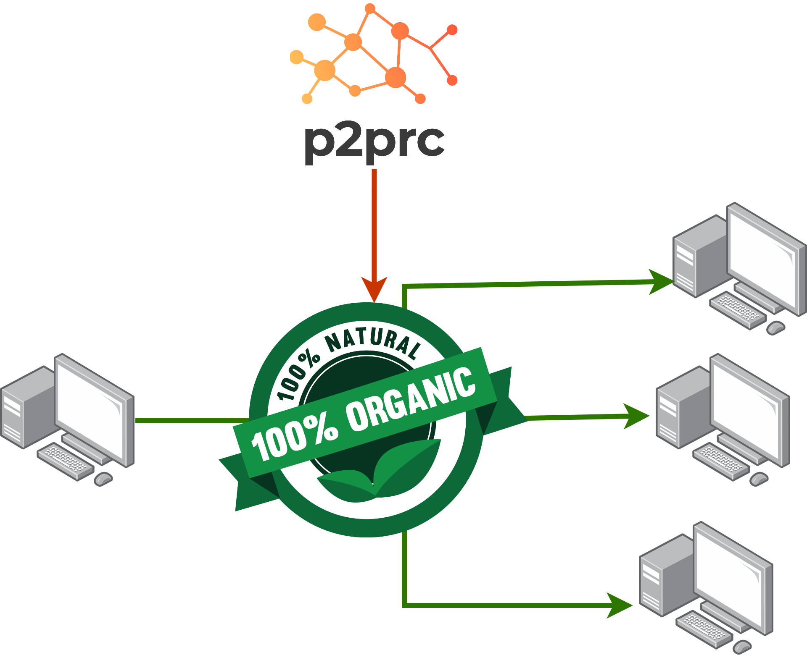
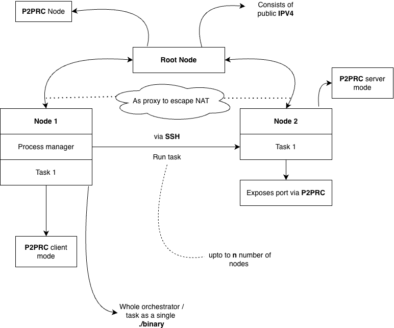
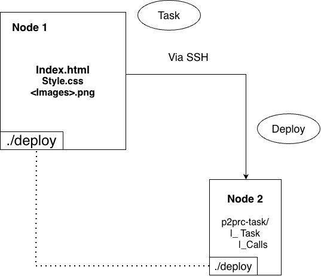

#+SETUPFILE: https://fniessen.github.io/org-html-themes/org/setup/html-theme-readtheorg.setup
#+HTML_HEAD: <link rel="stylesheet" type="text/css" href="style.css?version=1"/>

* Natural deploy
#+attr_html: :width 300px

** Source code: https://github.com/Akilan1999/Natural-deploy
* Motivation
Have you ever felt when using any declarative type of program
that is used for deployment. Its really unnatural to use (i.e you are a [[https://en.wikipedia.org/wiki/YAML][YAML]] developer). This is in
comparison to using any programming language [[https://en.wikipedia.org/wiki/Type_system#:~:text=Static%20type%20checking%20is%20the,properties%20for%20all%20possible%20inputs.][(Which has advanced static type checkers, error diagnosis etc...)]].

The 2nd issue is it's really hard to setup servers and can only work with nodes which have public IPs. Most orchestration
tools are built on the basis to use static IPs and fixed ports. 

The effect of this move is that you can easily get vendor locked and you are less likely to choose the economical
choice of owning your own hardware. We have lesser gratefullness of how complex problems were abstracted in simple tools
like [[https://en.wikipedia.org/wiki/File_Transfer_Protocol][FTP]], [[https://en.wikipedia.org/wiki/Git][GIT]], [[https://en.wikipedia.org/wiki/Org-mode][OrgMode]] or the [[https://en.wikipedia.org/wiki/Unix_philosophy][design principles of Unix]].

The aim of "Natural deploy" is to be a library which builds on top of [[https://p2prc.akilan.io/][P2PRC]] to make it as easy as running a binary to deloy your
custom tasks to your servers. This will gives you the flexibility to truly customise to build your own orchestration layer to
run your programs across your cluster of servers which can be situated anywhere.

* How does it work ?

#+CAPTION: High overview of Natural deploy
#+NAME:   fig:HOND

The diagram above is the high level overview of the architecture in figure [[fig:HOND]]. What's important
to note is that there are 3 nodes. The root node which is incharge of 
using the [[https://p2prc.akilan.io/#nat-traversal][Proxy implementation]] 
from P2PRC to help nodes escape NAT. 

 You will notice there is 2 other nodes. Node 1 which is the process 
 manager node for deploying tasks across to node 2 (We will call it a worker
 node). In reality you can have more than 1 worker node. The task is sent over
 via an SSH connection which uses P2PRC to map the port to escape NAT. The 
 SSH public key can be manually added to the worker node "authorizedkeys"
file. Or else you can play around with P2PRC "BareMetal" mode (There is no 
official documentation on this yet. Since it's still on the alpha stage).
The idea of the baremetal mode is to automatically propogate to the task machines
public keys to nodes in your P2PRC network which run as "BareMetal".

The task and worker nodes can be enabled by just running just a single binary. P2PRC
is also designed as library based P2P network which makes it modular by design. 
This means if you want to expand your exsisting application to compile and 
self-replicate itself on another worker node. You can embed these rules within
your application source code instead of having a seperate orchestrator program 
like [[https://kubernetes.io/][Kubernetes]] and makes you sane by calling functions rather than becoming a "YAML" developer. 

Another keypoint to emphasise is that programmers need to rely less on tools like [[https://www.docker.com/][Docker]]
and so we make it simpler to run your program as a single binary and it's ideal to track 
the process. To kill your task it's as simple as [[https://linux.die.net/man/1/pkill][pkill]] which runs on the kernel you installed on
the machine you own. 

* How to install
The only requirement if you are compiling from source is to have the Go compiler.
We will show this example by demonstrating a simple example which consists of 3 computers:

** General instruction to run
It's important to use the P2PRC master branch for this library. 
#+begin_src go
go get github.com/Akilan1999/p2p-rendering-computation@master
#+end_src

** The first computer (Root node):
Which is has a static public address. This is required to traverse traffic for your computers
behind NAT.
- Create a file called root.go
- Copy the following below into root.go
#+begin_src go
package main

import (
    "fmt"
    natural_deploy "github.com/Akilan1999/Natural-deploy"
    "github.com/Akilan1999/p2p-rendering-computation/client"
    "os"
)

func main() {

    // Checking if the lock file exists
    // if not configures the root node
    _, err := os.Stat("Root.lock")
    if err != nil {
        // Create the root node configuration. Function parameter (Node name
        // and port number)
        rootNode, err := natural_deploy.CreateRootNode("RootNode","3244")
        if err != nil {
            fmt.Println(err)
            os.Exit(1)
        }

        fmt.Println("----- Root Node information -------")
        client.PrettyPrint(rootNode)
        fmt.Println("-----------------------------------")
        fmt.Println("Daemon starting .....")

        os.Create("Root.lock")
    }

    err = natural_deploy.RunDaemon()
    if err != nil {
        fmt.Println(err)
        os.Exit(1)
        return
    }
    fmt.Println("Daemon started .....")

    for {

    }
}
#+end_src
- Compile root.go
#+begin_src bash
  go build root.go
  # Run the binary as a background process
  ./root &
#+end_src

- Store the output
 #+begin_src json
    {
       "Name": "RootNode",
       "MachineUsername": "",
       "IPV4": "<public ipv4 address>", // The public address of your root server
       "IPV6": "",
       "Latency": 0,
       "Download": 0,
       "Upload": 0,
       "ServerPort": "8088", // The default port of the root node 
       "UDPServerPort": "",
       "BareMetalSSHPort": "22",
       "NAT": false,
       "EscapeImplementation": "",
       "ProxyServer": false,
       "UnSafeMode": false,
       "PublicKey": "",
       "CustomInformation": ""
    }
 #+end_src

** The 2nd computer (The server behind NAT)
This could for instance be an old laptop which you would want to bring back to life.

- Create the file server.go
- Add the following to the server.go file. We are going call this server "Test-Server".
#+begin_src go
  package main

import (
	"fmt"
	natural_deploy "github.com/Akilan1999/Natural-deploy"
	"os"
)

func main() {
	_, err := os.Stat("Regular.lock")
	if err != nil {
		// Create the root node to be added
		var rootnode natural_deploy.RootNode
		// make sure to fill in "<>" area with the appropriate information
		rootnode.IPAddress = "<public ipv4 address>"
		rootnode.Port = "<ServerPort>" // (i.e 8088 by default) 

		err := natural_deploy.CreateRegularNode("Test-Server", &rootnode)
		if err != nil {
			fmt.Println(err)
			os.Exit(1)
			return
		}
		os.Create("Regular.lock")
	}

	// Start the daemon
	err = natural_deploy.RunDaemon()
	if err != nil {
		fmt.Println(err)
		os.Exit(1)
		return
	}

	for {

	}
}
#+end_src

- Compile server.go
  #+begin_src bash
    go build server.go
    # Run the binary as a background process
    ./server &
 #+end_src

** The 3rd Computer (Task machine)
This is can be your current laptop which can remotely deploy tasks to your self hosted server.
We are going to run a simple python server on the remote machine called "Test-Server". We will
start the task which will deploy the python server from our local machine to the "Test-Server"
machine which will then start the server and will internally call P2PRC function calls to provide
an static ip and port number from the Root node. Therefore escaping NAT which allows you to self
host. 
- Create the deploy script which we will call "test.sh" (The python server runs locally in 8000).
#+begin_src bash
  nohup python3 -m http.server 8000 > server.log 2>&1 &
#+end_src
- Create a script to kill the deployed python server. We will call this "kill.sh".
#+begin_src bash
  kill -9 $(lsof -t -i:8000)
#+end_src
- Create the file task.go
- Add the following to task.go
#+begin_src go
      package main

    import (
        "fmt"
        natural_deploy "github.com/Akilan1999/Natural-deploy"
        "github.com/Akilan1999/p2p-rendering-computation/client"
        "github.com/Akilan1999/p2p-rendering-computation/p2p"
        "os"
        "time"
    )

    func main() {
        _, err := os.Stat("Task.lock")
        if err != nil {
            // If you want to add a custom root node
            var rootnode natural_deploy.RootNode
            // make sure to fill in "<>" area with the appropriate information
            rootnode.IPAddress = "<public ipv4 address>"
            rootnode.Port = "<ServerPort>"
            // Name of the task machine
            natural_deploy.CreateTaskMachine("Task", &rootnode) 
        }

        // Create a 5 second delay from mapping port
        time.Sleep(5 * time.Second)

        // ------------------- Create a task -----------------
        var task natural_deploy.Task
        task.Name = "Test"
        task.TaskFile = "test.sh"
        task.KillTaskFile = "kill.sh"

        // Get all node information
        table, err := p2p.ReadIpTable()
        if err != nil {
            fmt.Println(err)
            os.Exit(1)
            return
        }

        fmt.Println("IP table read")

        // Searching for the information of a particular
        // node information (In this example Test-2 node)
        var machineInfo p2p.IpAddress
        for i, _ := range table.IpAddress {
            if table.IpAddress[i].Name == "Test-1" {
                machineInfo = table.IpAddress[i]
            }
        }

        fmt.Println(machineInfo)

        // Allocate ports
        var port client.ResponseMAPPort
        port.PortNo = "8000"
        task.ExposedPorts = append(task.ExposedPorts, &port)

        task.NodeInfo = &machineInfo
        // ---------------------------------------------------------

        err = task.CreateTask()
        if err != nil {
            fmt.Println(err)
            os.Exit(1)
            return
        }

        // Create a 10 second delay from mapping port
        time.Sleep(10 * time.Second)

        err = task.KillTask()
        if err != nil {
            fmt.Println(err)
            os.Exit(1)
            return
        }

    }

#+end_src
- Compile server.go
  #+begin_src bash
     go build task.go
     # Run the binary as a background process
     ./task &
  #+end_src

* Creating a task through an example
#+CAPTION: Structure of a task
#+NAME:   fig:SOFAT

The diagram above in figure [[fig:SOFAT]] shows the attributes required for a task
and the it's structure when deployed to a worker node. This is created by an example
which is deploying a simple static webpage and it's also how the current webpage is deployed.

Let's look at the first box on the top which consists of 3 files
we are going to send over via a file transfer using a SSH connection. 
The inner rectangle consists of the "./deploy" binary which will send itself 
and 3 files to the worker machine. This means the machine running the "./deploy"
binary is the task machine. 

When a task is deployed at the first time, refer to the 2nd box which is node 2. 
A folder called "p2prc-task/" with a sub folder consisting of the task name is created in
the home directory. This means apart from a SSH connection nothing else is needed 
for deploying a task. 

The flags shown in figure [[fig:SOFAT]] will build on the code snippets
as shown below based on this [[https://github.com/Akilan1999/Natural-deploy/blob/master/docs/Deploy.go][file]]: 

#+CAPTION: File structure of the task
#+NAME:  Lis:FileStructure
#+begin_src bash
- Deploy.go (Source code to deploy)
- compile.sh (Cross compile to linux -> deploy.go)
- run.sh (Instruction of the remote machine to start the process)
- exit.sh (Instuction to kill on the remote machine the task)
- Index.html, style.css, <diagrams / pictures> (Static assets to transfer over)
#+end_src

The listing [[Lis:FileStructure]] shows the main files required to deploy 
the following documentation webpage. 

#+CAPTION: Flags we are creating
#+NAME:  Lis:Flags
#+begin_src bash
  -d string
    	the directory of static file to host (default ".")
  -daemon
    	Starts the background process to learn about nodes in the network
  -deploy
    	Deploy the webpage to the designated machine
  -kill
    	Kills the deployed task
  -ls
    	List processes
  -p string
    	port to serve on (default "8034")
  -update
    	Updates the documentation content
#+end_src

#+CAPTION: Start P2PRC server mode using the -daemon flag (Worker node)
#+NAME:  Lis:Daemon
#+begin_src go
func Daemon() error {
    _, err := os.Stat("Task.lock")
    if err != nil {
        err := natural_deploy.CreateTaskMachine("<Your worker machine name>", nil)
        if err != nil {
            return err
        }

        os.Create("Task.lock")
    }

    err = natural_deploy.RunDaemon()
    if err != nil {
        return err
    }

    return nil
}
#+end_src

The listing [[Lis:Daemon]] shows the only setup needed in the worker node to run it as background process 
or daemon to broadcast itself in a zero configuration manner to the other task and worker nodes. There is 
lock file created to ensure once this configurations is set to start daemon directly. 

#+CAPTION: Deploy the task to the worker node -deploy flag (Task node)
#+NAME:  Lis:Deploy
#+begin_src go
// Name: Name of the task 
func Deploy(Name string) error {
    // Creating the task type
    var task natural_deploy.Task

    // Setting the name of the task
    task.Name = Name

    // Points to start the process on the worker node
    task.TaskFile = "run.sh"

    // Points to kill the process on the worker node
    task.KillTaskFile = "exit.sh"

    // To the worker machine you want to deploy the task in
    task.DeployMachine = "<Your worker machine name>"

    var err error

    // Allocate ports
    var port natural_deploy.Ports
    port.Port = "<TCP port in which your task will run>"
    port.DomainName = "<Domain name you want to exposed your task TCP port to>"
    task.ExposedPorts = append(task.ExposedPorts, &port)

    // ------------------------------------------------------------------------------
    // ------------------------------------------------------------------------------

    // In this example this binary will cross compile 
    // to the linux x86 architecture and deploy itself to worker node
    // as server running on the <TCP port in which your task will run>. 

    // Check if the linux binary to run is compiled
    _, err = os.Stat("Deploy-Linux")
    if err != nil {
        err = SelfCompileLinux()
        if err != nil {
            return err
        }
    }

    // ------------------------------------------------------------------------------
    // ------------------------------------------------------------------------------

    // Sends files for setup
    err = task.SendFile("<path of file you would want to send over>")
    if err != nil {
        return err
    }

    .... n number of files to send

    // Creates and runs the task on the worker node
    err = task.CreateTask()
    if err != nil {
        return err
    }

    // Print out the processes created
    ListProcess()

    return nil
}
#+end_src

#+CAPTION: Update the task to the worker node -update flag (Task node). In our case doing a few file transfer to update exsisting files. 
#+NAME:  Lis:Update
#+begin_src go
// Name: <Task name>
func Update(Name string) error {
    task, avaliable := natural_deploy.ViewTasks(<Task name>)
    if !avaliable {
        return errors.New("task not found")
    }

    // Send the files you need to update or a new file
    // to send over.
    err := task.SendFile("<path of file you would want to send over>")
    if err != nil {
        return err
    }

    .... n number of files to send

    return nil
}
#+end_src

#+CAPTION: Kill the task to the worker node -kill flag (Task node). 
#+NAME:  Lis:Kill
#+begin_src go
// Name: <Task name>
func KillProcess(Name string) error {
    task, avaliable := natural_deploy.ViewTasks(Name)
    if !avaliable {
        return errors.New("task not found")
    }

    err := task.KillTask()
    if err != nil {
        return err
    }

    return nil
}
#+end_src

#+CAPTION: The main function (Task node). 
#+NAME:  Lis:Main
#+begin_src go
func main() {
    // ------------------------- Defining the flags --------------------------------
    deploy := flag.Bool("deploy", false, "Deploy the webpage to the designated machine")
    kill := flag.Bool("kill", false, "Kills the deployed task")
    daemon := flag.Bool("daemon", false, "Starts the background process to learn about nodes in the network")
    update := flag.Bool("update", false, "Updates the documentation content")
    ls := flag.Bool("ls", false, "List processes")
    port := flag.String("p", "8034", "port to serve on")
    directory := flag.String("d", ".", "the directory of static file to host")
    flag.Parse()
    // ------------------------------------------------------------------------------

    // ------------------------ Handlers for the flags ------------------------------

    if *deploy {
        err := Deploy("<task name>")
        if err != nil {
            fmt.Println(err)
            return
        }
        return
    }

    if *update {
        err := Update("<task name>")
        if err != nil {
            fmt.Println(err)
            return
        }
        return
    }

    if *kill {
        err := KillProcess("<task name>")
        if err != nil {
            fmt.Println(err)
            return
        }
        return
    }

    if *daemon {
        err := Daemon()
        if err != nil {
            fmt.Println(err)
            return
        }
        for {

        }
    }

    if *ls {
        ListProcess()
        return
    }

    // ------------------------------------------------------------------------------

    // -------- part of the code executed on the task machine ------------

    http.Handle("/", http.FileServer(http.Dir(*directory)))

    log.Printf("Serving %s on HTTP port: %s\n", *directory, *port)
    log.Fatal(http.ListenAndServe(":"+*port, nil))

    // -------------------------------------------------------------------
}
#+end_src